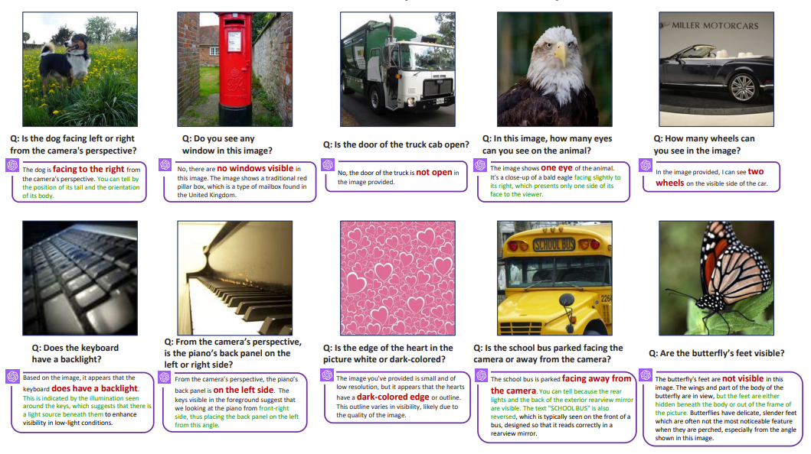
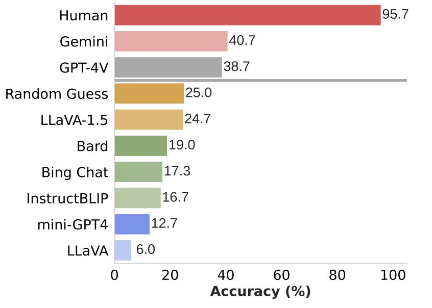
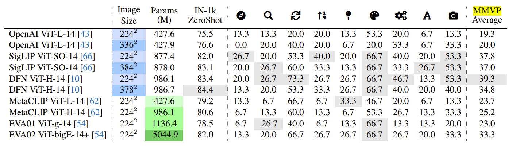

# Eyes Wide Shut? Exploring the Visual Shortcomings of Multimodal LLMs

[Shengbang Tong](https://tsb0601.github.io/petertongsb/), [Zhuang Liu](https://liuzhuang13.github.io/), [Yuexiang Zhai](https://yx-s-z.github.io/), [Yi Ma](https://people.eecs.berkeley.edu/~yima/), [Yann LeCun](https://yann.lecun.com/), [Saining Xie](https://www.sainingxie.com/)
               
### [Paper](https://arxiv.org/abs/2401.06209) | [Project Page](https://tsb0601.github.io/mmvp_blog/) | [MMVP Benchmark](https://huggingface.co/MMVP)





## Contents:
1. [Getting Started](#start)
2. [Benchmark](#benchmarks)
3. [Evaluation](#evaluation)
4. [Training](#training)
5. [License](#license)
6. [Citation](#citation)
7. [Acknowledgement](#acknowledgement)

## Getting Started <a name="start"></a>

### Installation
```
conda create -n mmvp python=3.10 -y
conda activate mmvp
cd LLaVA
pip install -e .
pip install flash-attn --no-build-isolation
```

### Pre-trained Model

The Interleaved-MoF Models (Based on LLaVA-1.5 13b) can be found [here](https://huggingface.co/MMVP/MoF_Models/tree/main).


## Benchmarks <a name="benchmark"></a>

### MMVP Bechmark
Our MMVP Benchmark is available [here](https://huggingface.co/datasets/MMVP/MMVP). It is specially crafted to measure **multimodal LLM's** visual capability via VQA. 
The benchmark is seperated into a folder containing all 300 testing images and an annotation csv file with questions and correct answers. The format of the data is:
```
├── MMVP Images
│   ├── 1.jpg
│   ├── 2.jpg
│   ├── 3.jpg
│   ├── ...
│   └── 300.jpg
└── Questions.csv
```

### MMVP VLM Bechmark
Our MMVP-VLM Benchmark is available [here](https://huggingface.co/datasets/MMVP/MMVP_VLM). It is distilled from the MMVP benchmark above and simplified the language description for each image. It is designed to evaluate **VLMs** such as CLIP's visual capability. The benchmark is organized into 9 different visual patterns. In each visual pattern, there are 15 pairs of zero-shot questions. An annotation csv file contains the question, correponding visual pattern and images. 
The format of the data is:

```
├── MMVP_VLM_Images
│   ├── Orientation
│   │   ├── 1.jpg
│   │   ├── 2.jpg
│   │   ├── ...
│   │   └── 30.jpg
│   ├── Presence
│   │   ├── 31.jpg
│   │   ├── 32.jpg
│   │   ├── ...
│   │   └── 60.jpg
│   ├── ...
│   └── Camera_Perspective
│       ├── 241.jpg
│       ├── 242.jpg
│       ├── ...
│       └── 270.jpg
└── Questions.csv
```

## Evaluation <a name="evaluation"></a>

To evaluate on the MMVP, run 
```
python scripts/evaluate_mllm.py --directory PATH_TO_MMVP_BENCHMARK_FOLDER --model-path PATH_TO_MODEL_EVALUATED
```
The script provide an evaluation for LLaVA based models that generate a jsonl file containing questions, correct answer and model response. Feel free to modify the script and apply on other models. 

After generating model's response, one can manually check the accuracy or use a LLM (e.g. GPT-4) to generate the score. 
```
python scripts/gpt_grader.py --openai_api_key YOUR_OPENAI_API_KEY --answer_file PATH_TO_MODEL_RESPONSE_EVALUATED
```

Here is the result of *SOTA* models on MMVP Benchmark. It shows that these leading models consistently struggles with these straightforward questions on visual grouding, 



To evaluate on MMVP-VLM, run
```
python scripts/evaluate_vlm.py --directory PATH_TO_MMVPVLM_BENCHMARK_FOLDER
```
Here is the result of *SOTA* CLIP models on MMVP-VLM Benchmark. It shows that scaling up parameters and image resolution in CLIP models obtain very little improvement on discerning these visual patterns.



## Training <a name="training"></a>

The training of the Interleaved-MoF MLLM model follows the training procedure of LLaVA. Please follow the data preparation process in LLaVA. Please replace the directory to data in the training data to your local directories. 


For the pre-training stage, enter the LLaVA folder and run
```
sh pretrain.sh
```

For the instruction tuning stage, enter the LLaVA folder and run
```
sh finetune.sh
```

One can also find the plug and play changes nessecary to Interleaved-MoF in "LLaVA/llava/model/llava_arch.py/#L155". The function *prepare_inputs_labels_for_multimodal_withdino* contains ways to spatially interleave DINOv2 and CLIP features before feeding to the LLM. 


## License <a name="license"></a>

This project is under the MIT license. See [LICENSE](LICENSE) for details.

## Citation <a name="citation"></a>
Please consider citing our paper if you find this project helpful for your research:

```bibtex
@misc{tong2024eyes,
      title={Eyes Wide Shut? Exploring the Visual Shortcomings of Multimodal LLMs}, 
      author={Shengbang Tong and Zhuang Liu and Yuexiang Zhai and Yi Ma and Yann LeCun and Saining Xie},
      year={2024},
      eprint={2401.06209},
      archivePrefix={arXiv},
      primaryClass={cs.CV}
}
```

## Acknowledgement <a name="acknowledgement"></a>
-  This work is built upon the [LLaVA](https://github.com/haotian-liu/LLaVA) . 
